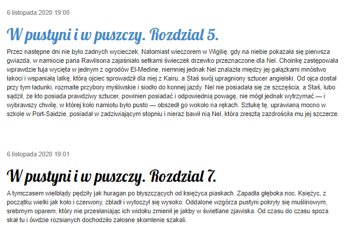

# Lab_1 Blog uruchomiony na PaaS

### Wykorzystano:
* Python - Django
* Bootstrap
* HTML
* CSS

***

## Dodano również opcję usuwania postu
* widnieje w scieżce post/&lt;id&gt;
* po usunięciu następuje automatyczne przekierowanie do strony domowej

***
## Lista postów przed ( usunięciem postu nr. 6).

## Lista postów po.

