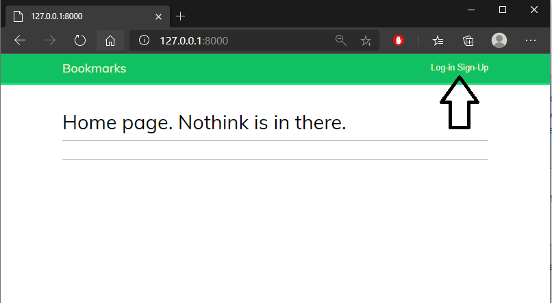
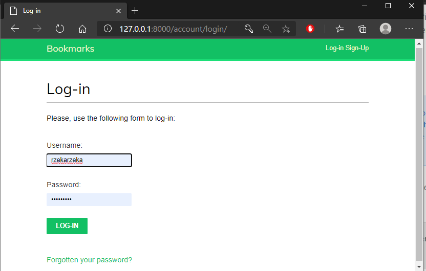
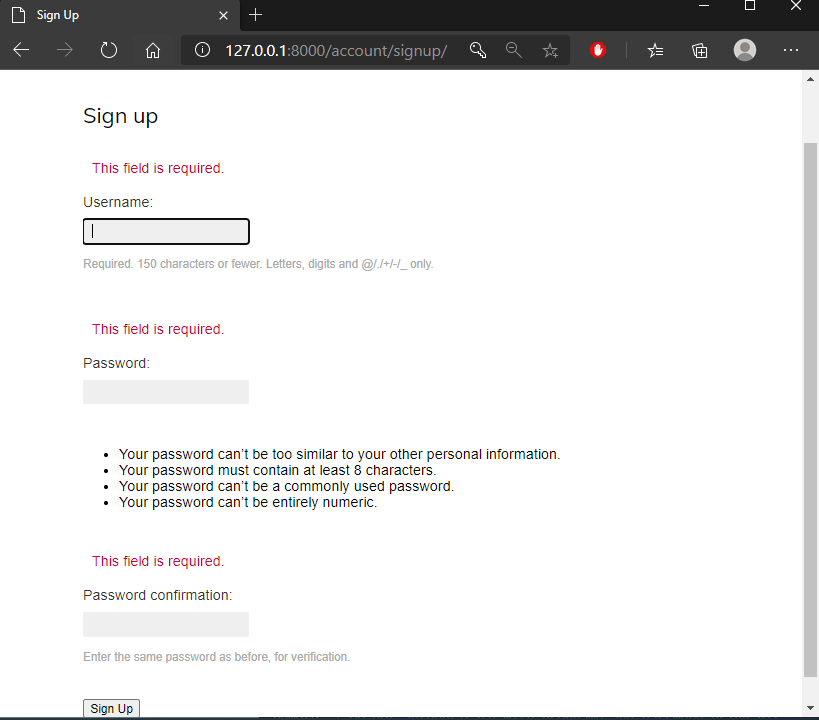
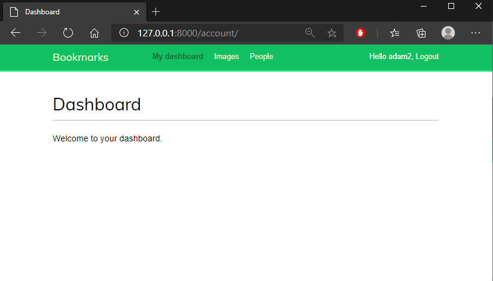
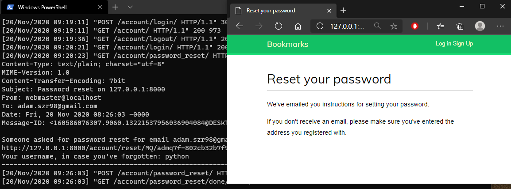
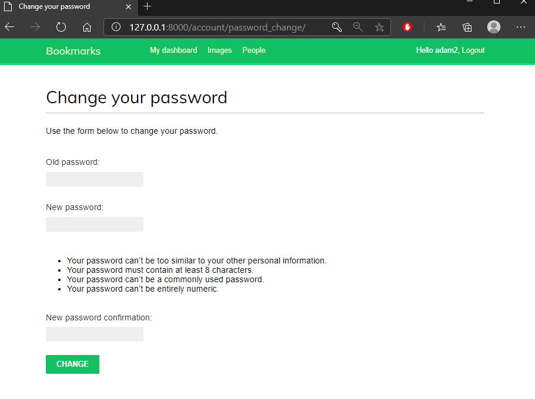

# Lab_2 Rejestracja użytkowników *[LINK](https://enigmatic-brushlands-25919.herokuapp.com/)*

### Wykorzystano:
* Python - Django
* Bootstrap
* HTML
* CSS

***

## Opracowano następujące widoki:

#### Home View -> ścieżka ''
* Jak widać dodatkowo zamieściłem Sign Up view.

#### Login -> ścieżka '/account/login/'

#### Sign-Up -> ścieżka '/account/signup/'

#### Dashboard -> ścieżka '/account'
* Gdy zalogowane konto posida uzupełnione pole 'first name', w dashboard widzimy imię.

#### Password reset + Backend E-MAIL -> ścieżka '/account/password_reset/'
* Wyświetlenie zawartości e-mail w ConsoleBackend. 

#### Password change -> ścieżka '/account/password_change/'
* Dodatkowa opcja Password Change View.

