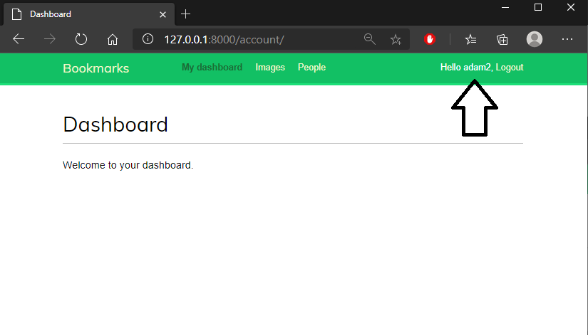

# Lab_2 Rejestracja użytkowników

### Wykorzystano:
* Python - Django
* Bootstrap
* HTML
* CSS

***

## Opracowano następujące widoki:

#### Home View -> ścieżka ''

#### Login -> ścieżka '/account/login/'

#### Sign-Up -> ścieżka '/account/signup/'

#### Dashboard -> ścieżka '/account'

#### Password reset + Backend E-MAIL -> ścieżka '/account/password_reset/'

#### Password change -> ścieżka '/account/password_change/'

