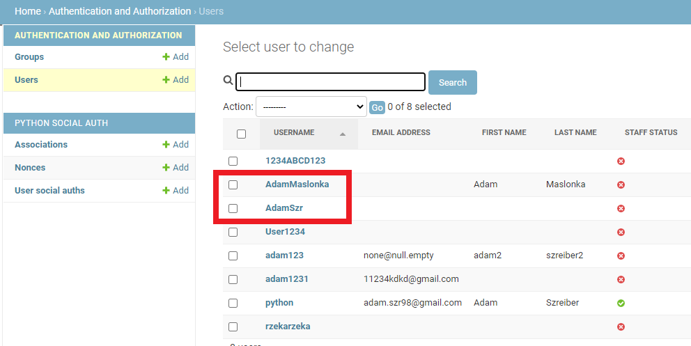

# Lab_3 Różne sposoby uwierzytelniania *[LINK](https://a-social-website.herokuapp.com/)*

### Wykorzystano:
* Python - Django
* Bootstrap
* HTML
* CSS

***

## Poniżej przedstawiam osiągnięte efekty:

#### Certyfikat - prawdopodobnie tylko po to, aby lokalnie działało.
 

#### Logowanie poprzez FB '
fake account -> 
#### Akceptacja dostępu.

#### Logowanie FB przekierowanie.

#### Logowanie poprzez Github.

#### Logowanie Github przekierowanie.

#### Widok użytkowników z poziomu admina.
