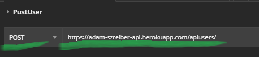
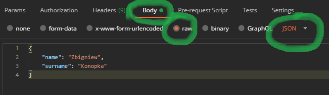
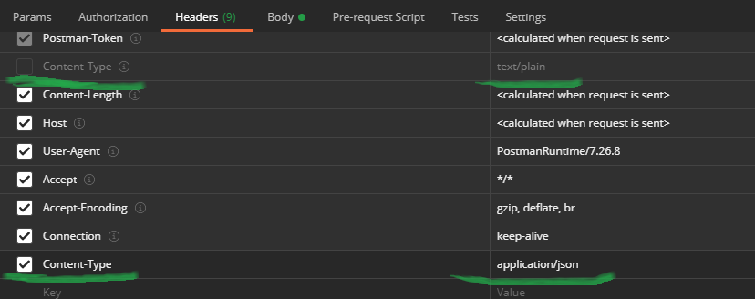
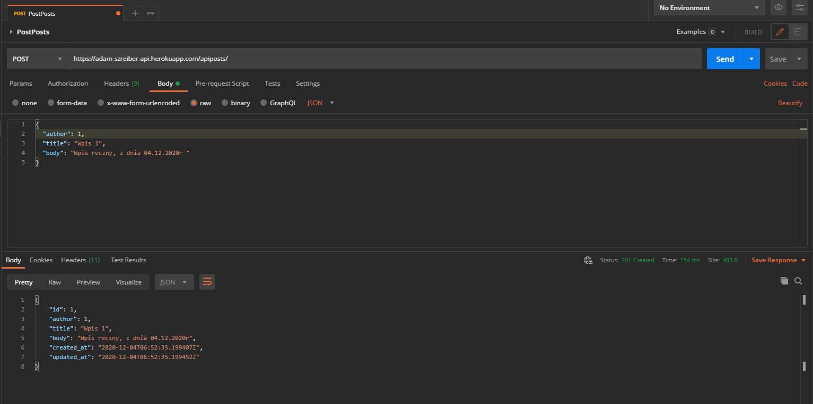
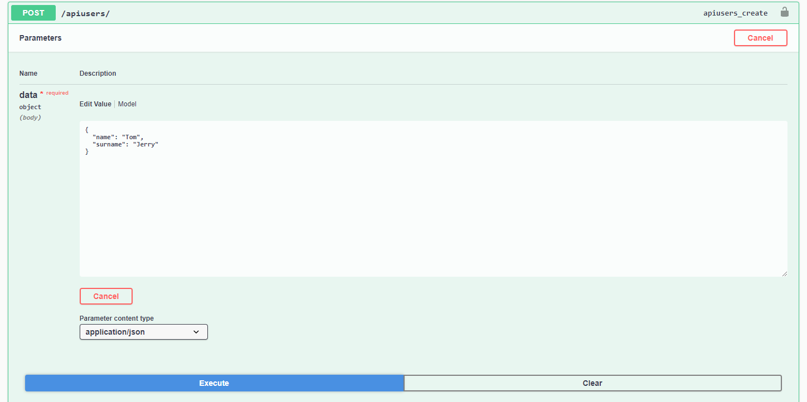
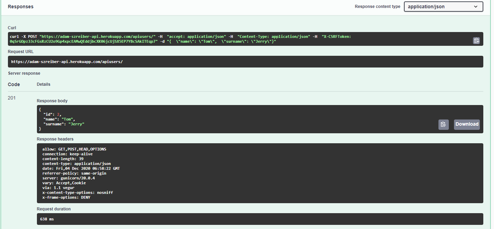
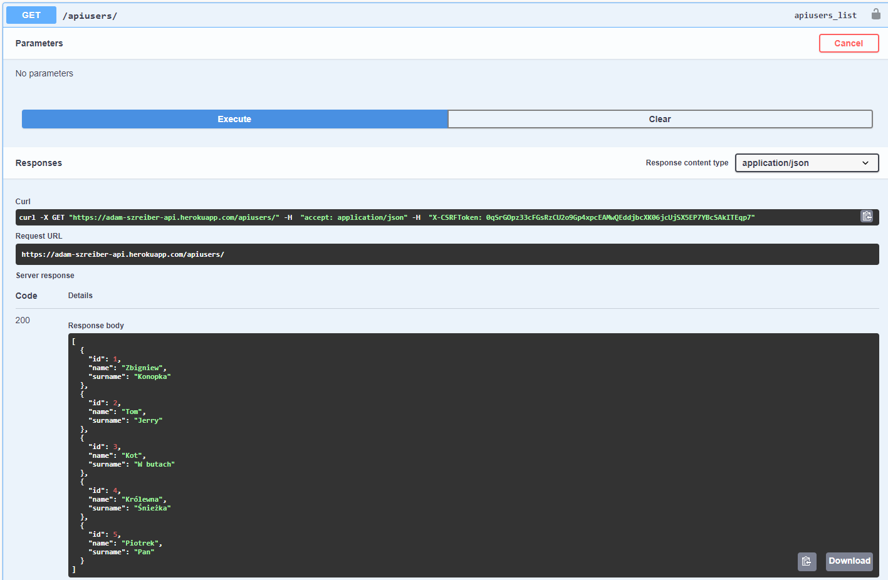
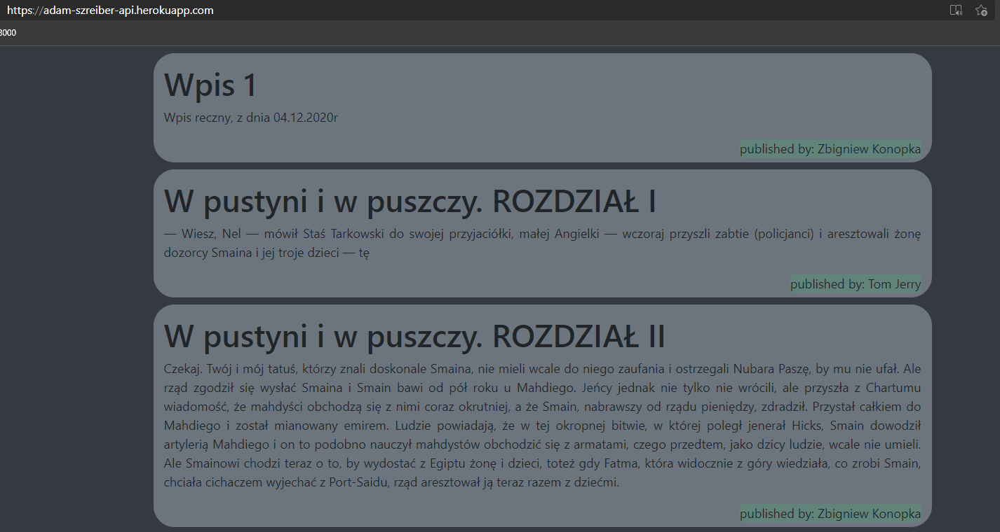

# Lab_4 REST API z DRF
##[Strona Główna](https://adam-szreiber-api.herokuapp.com/)
##[Swagger](https://adam-szreiber-api.herokuapp.com/swagger/)

### Wykorzystano:
* Python - Django
* HTML
* CSS
* Django Rest Framework
***

## Poniżej przedstawiam osiągnięte efekty:

#### Wykożysatłem 2 narzędzia do wstawiania elementów.
* za pomocą Postman'a
* za pomocą Swagger'a

#### Postman, tworzenie user'a

- w pierwszej kolejności zmieniłem verb i wpisałem url.
 

- następnie w zakładce body wrzuciłem model usera opisany w formacie json.
 

- ostatnia modyfikacja to zmiana nagłówka content-type .
 
Wyrzuciłem domyślny wpis Content-Type: text/plain, i w ostatniej lini dopisałem application/json.
Można również ten krok zrobić w zakładce body (patrz zakładka 'Body'), wybierając odpowiedni format wpisu (również jest 'json').

- Stworzenie 1 postu.
 

#### Swagger, tworzenie user'a
- Tutaj wszystko jest 'prostsze' lecz, jest to znacznie mniej powerfull narzędzie.
- Natomiast fajną opcją jest podgląd komendy curl - kolejne bradzo popularne narzędzie do testowania aplikacji sieciowych.
 

- Oto odpowiedź na ryc wyżej.
 

#### Ostateczny efekt:
- 5 użytkowników
 
- Kilka postów, które widoczne są na stronie głównej.
 

