# Lab_5 Web Scraping
## [Link do zadania](https://zacniewski.gitlab.io/teaching/2020-internet-apps/)
 
### Wykorzystano:
* Python - moduły [re,csv,requests,bs4]
 
## W każdym z poniższych przykładów dodałem własne komentarze ( w kodzie ), oraz fragmenty z python DOCS, które tłumaczą pewne zagadnienia
 
#### Zadanie: należy przeanalizować i wdrożyć kod z repozytorium do zajęć,
 
## Instalacja modułów
Po domyślnej instalacji Python'a 3.9 nie posiadamy wymaganych modułów. Należy wykonać instalację.
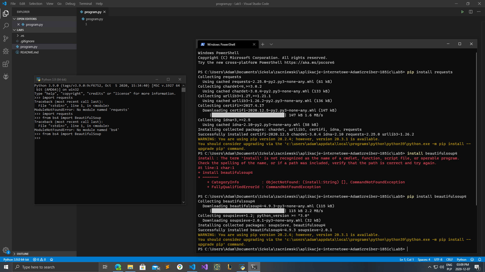 
 
## BeautifulSoup inne parsery - wymagają instalacji.
* default 'html.parser' included in Python’s standard library
 
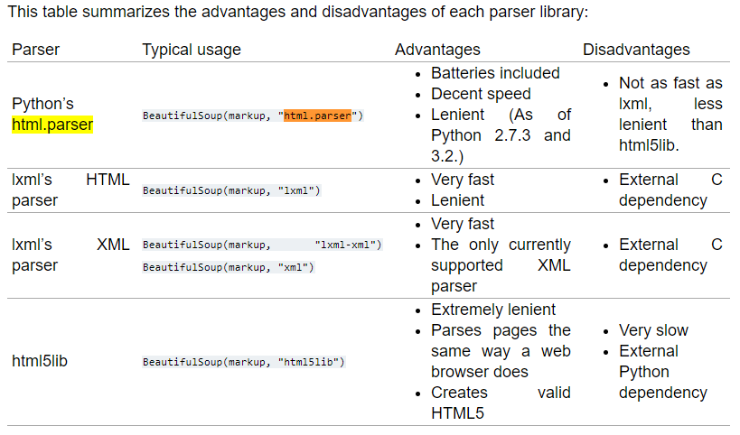 
 
## Przykład 1. plik - 4-web-scraping-example4
* Prosty przykład w którym, pobieramy stronę, wyszukujemy element 'h1', w pętli dla każdego 'h1' wybieramy text który zawiera i wrzucamy do listy. 
* Następnie szukamy wszystkie elementy 'p', wybieramy element o idx=0, pobieramy text który zawierał ten znacznik.
* Efekt poniżej widoczny, to wypisanie listy z podpunktu 1, oraz text'u z podpunktu 2. 
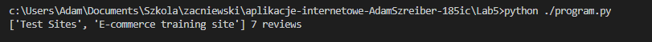 
 
## Przykład 2. plik - 4-web-scraping-example5
* W tym przykładzie wybierane są wszystkie div'y które mają przypisaną klasę 'thumbnail'
* 1 linia ->  wyświetlany jest napis "liczba top items", a wartość 3, ponieważ długość tablicy z podpunktu wyżej jest = 3.
* Dla każdego div'a wybranego w 1-szym podpunkcie, kolejnym krokiem było wybranie wszystkich elementów 'a' z przypisaną klasą 'title', ale tylko takie które mają element 'h4' jako rodzica.
* Kolejno, wybrane zostały elementy 'div' z przypisaną klasa 'ratings', z elementu o idx=0, pobrano text
* 2 linia to -> efekt widoczny to złączenie podpunktu 3 i 4 ( tytuł oraz liczba odwiedzin )
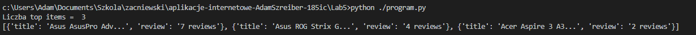 
 
## Przykład 3. plik - 4-web-scraping-example6
* ten przykład jest zbyt prosty aby cokolwiek opisywać.
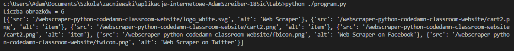 
 
## Przykład 4. plik - 4-web-scraping-example6_lab
* Wybieramy wszystkie znaczniki 'a'
* dla każdego znacznika, pobieramy jego text oraz href (link)
* dopisujemy do listy
* wyświetlamy listę.
 
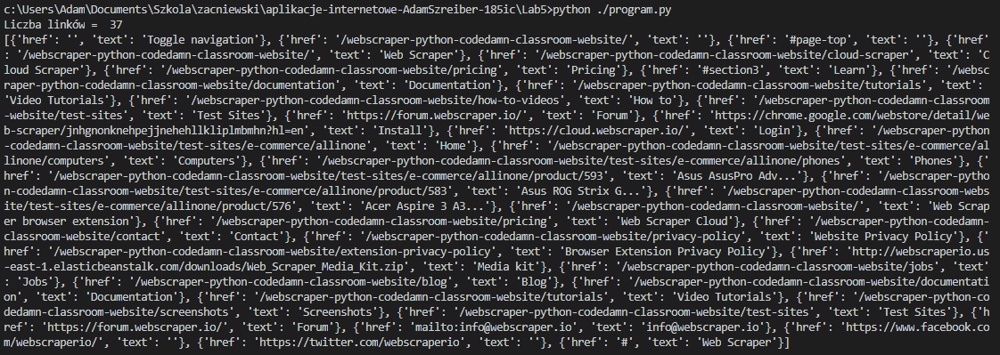 
 
## Przykład 5. plik - 4-web-scraping-example7
* Wybieramy wszystkie elementy 'div' z przypisana klasa 'thumbnail'
* Dla każdego znacznika, znajdź 'a' takie że rodzic jest elementem 'h4', weź element o idx=0, pobierz text, (to będzie **nazwa produktu**)
* Dla każdego znacznika, znajdź takie 'p' że posiada przypisaną klasę 'description', weź element o idx=0, pobierz text, (to będzie **opis produktu**)
* Dla każdego znacznika, znajdź takie 'h4' że posiada przypisaną klasę 'price', weź element o idx=0, pobierz text, (to będzie **cena produktu**)
* Dla każdego znacznika, znajdz takie 'div' że posiada przypisaną klasę 'ratings', weź element o idx=0, pobierz text, (to będzie liczba **odsłon produktu**)
* Dla każdego znacznika, znajdz 'img', weź element o idx=0, pobierz wartość atrybutu 'src' ( to będzie **relative path** do obrazka ). 
 
Efekt wypisania w konsoli. (keys = nagłówki, values = dane)
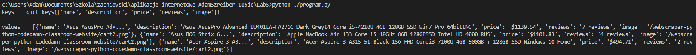 
Widok po zapisaniu do pliku.
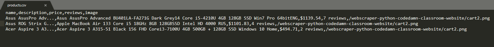 
Przeprowadziłem równieź import do Excel'a

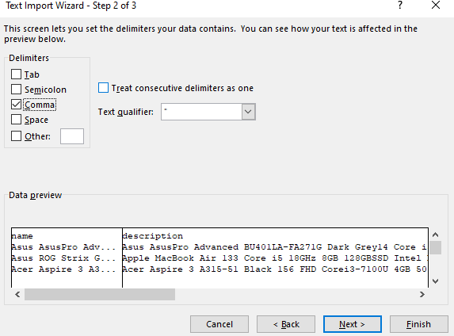 
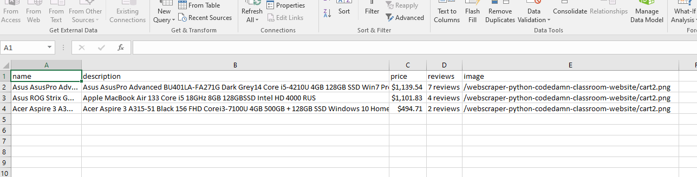 
 
 
## Przykład 6. plik - 4-web-scraping-part1
* Test 1 - pobiera stronę za pomocą metody requests.get(), wyświetlenie obiektu zwróconego. (ten obiekt to: <Response [200]>).
* Wyświetlenie właściwości status_code, obiektu zwróconego.
* Wyświetlenie 30 pierwszych znaków strony html.
* Test 2 - wykonanie api-call aby pobrać dane o użytkowniku.
* Konwersja obiektu zwróconego pierw na json, następnie na dict.
* Wyświetlenie właściwości url.
* Wyświetlenie całego obiektu dict, zawierającego informacje o użytkowniku.
* Wyświetlenie właściwości history. ( gdy serwer do którego wykonujemy zapytanie przekierowuje nas do innego adresu, wtedy  dodawane są tutaj adresy. )
 
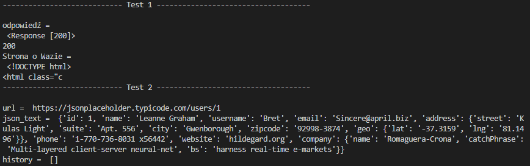 
 
*  Test 3, podstawowe wywołania właściwości. [Link do dokumentacji](https://www.crummy.com/software/BeautifulSoup/bs4/doc/)
 
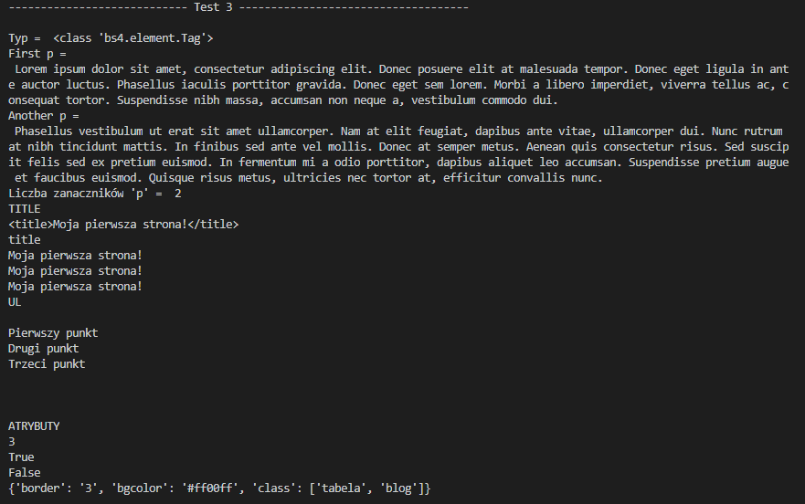 
 
 
#### plusy za własne przemyślenia, analizę dokumentacji i idące za nimi modyfikacje w projekcie.
* Za pomocą Regex wykonałem  modyfikacje w podpunkcie z csv, aby pozbyć się wszystkich znaków nowej linii, tabulatorów, oraz '.' ',' '"'
 
 

