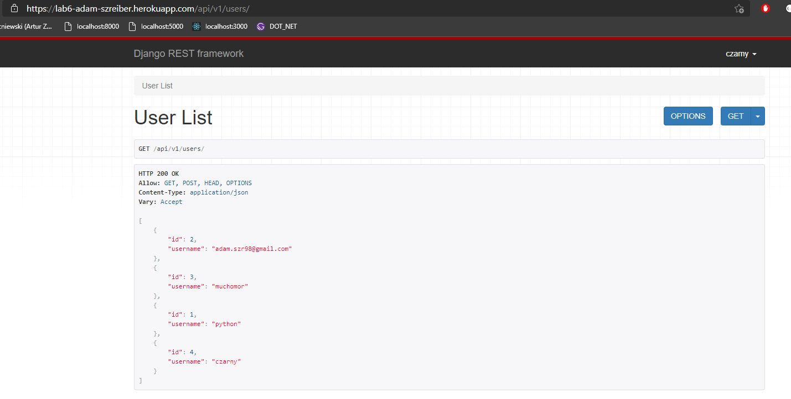

# Lab_6 Zezwolenia i uwierzytelnianie w DRF

## [Strona Główna - Licznik](https://lab6-adam-szreiber.herokuapp.com/)

## [Rejestracja](https://lab6-adam-szreiber.herokuapp.com/api/v1/rest-auth/registration/)
## [Logowanie](https://lab6-adam-szreiber.herokuapp.com/api-auth/login/)
## [GET /api/users](https://lab6-adam-szreiber.herokuapp.com/api/v1/users/) --> Wymagana autoryzacja.
## [GET /api/posts](https://lab6-adam-szreiber.herokuapp.com/api/v1/posts/) --> Dostęp free.

## Modyfikacje:
- Dodano licznik wejść.
- Licznik ma ustawiony czas na 1-minutę, zamiast 1 dnia.

## Poniżej przedstawiam osiągnięte efekty:

* Licznik wejść: 
 

* Użytkownik zalogowany, Widok postów - po autoryzacji:
 

* Użytkownik zalogowany, Widok użytkowników - po autoryzacji:
 

* Użytkownik zalogowany, Widok postów - bez autoryzacji:
 

* Użytkownik zalogowany, Widok użytkowników - bez autoryzacji:
 

* App-heroku Widok listy użytkowników, wymagana autoryzacja.
 
