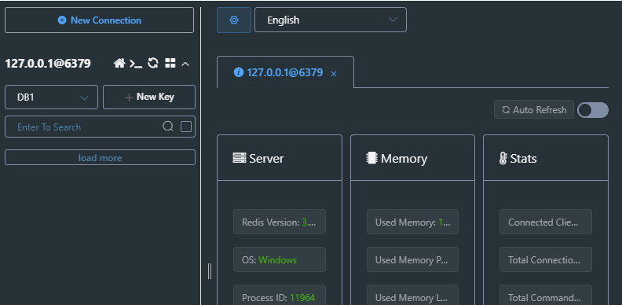

# 7. Python + Redis + Django

## Modyfikacje:
- Dodano licznik wejść.
- Licznik ma ustawiony czas na 1-minutę, zamiast 1 dnia.

## Ćwiczenia z redis'em

W celu sprawdzenia połączenia z redisem stosuje się metodę ping().

 

rpush(nazwaListy,*values) ➔ wrzuca po kolei wartości na koniec listy.

lrange(nazwaListy,startPos,endPos) ➔ pobiera wartości od lewej strony. endPos = -1 mówi `zabierz wszystkie wartości - do końca listy`

 

Widok w bazie danych.

 

lrange ➔ w tym przypadku wybierane sa wartości od elementu 1 (indexowanie startuje od 0), 3 kolejne elementy.

 

set(key,value) ➔ przypisuje kluczom podane wartości.
 

Podgląd bazy DB0

 

Podgląd bazy DB1, brak klucza 'key', ponieważ konstruktor domyślnie łączy z baza DB0. Tam wlasnie był utworzony klucz.
pełen konstruktor ➔ Redis(host, port, db)

 

setex(name, time, value) ➔ przypisuje wartość do klucza, lecz w raz z wygaśnięciem czasu klucz znika.

set(name, value)  oraz expire(name, time) ➔ powyższa funkcja to ich złożenie.
 

sadd(name, *values) ➔ dodaje wartości do zbioru, reprezentowanego przez wskazany klucz 

smembers(name) ➔ zwraca wszystkie wartości przypisane do klucza.

 

sadd(name, *values) ➔ dodaje wartości do zbioru, reprezentowanego przez wskazany klucz

zrange(name, start, end) ➔ zwraca część posortowanej kolekcji, end = -1 oznacza `aż do konca.` 

 

hset(name, key, value) ➔ przypisuje wartości do klucza, brak możliwości dodania 2 wartości do tego samego klucza. (relacja 1==1)

 

Widok w bazie danych.

 

pubsub(**kwargs) ➔ zwraca publikujący/subskrybujacy objekt, można zasubskrybować kanał, aby nasłuchiwać na wiadomości wrzucone do kanału.
listen() ➔ nasłuchuje na wiadomość, po otrzymaniu zwraca.
 

psubscribe(*args,**kwargs) ➔ pattern subsciribe, oznacza że wiadomości będziemy odbierać, gdy nazwa kanału będzie pasowała do podanego wzoru.
 

## Poniżej przedstawiam osiągnięte efekty:

Ręczne dodanie zadania.
 

Widok przygotowanej strony.
 

Wybór pliku do wytworzenia miniaturki.
 

Widok ruchu po stronie serwera.
 

Przesłany kompresowany plik trafia do /media/images.

 

Wypakowane pliki: 

 

Porównanie wypakowanych zdjęć.
 