# 10. Django + React (aplikacja typu ToDo)

- Modyfikacje jakie wprowadziłem :

<i>backend/settings.py</i>
CORS_ORIGIN_ALLOW_ALL = True

W wyżej wymienionej zmiennej deklaruję informacje, iż nie ważne z jakiego addresu przyjdzie request, zostanie on zawsze obsłużony. W dokumentacji opisali, iż definiowanie cors_all = true może być niebezpieczne, niemniej jednak aplikacja frontend miał problem aby połączyć się z backend, a jedyna opcja która działa to własnie cors_all.

Domyślnie wartość jest false, i należy zdefiniować jedną z poniższych zmiennych, która definiuje dostęp.
- CORS_ALLOWED_ORIGINS = ['',]
- CORS_ALLOWED_ORIGIN_REGEXES = ['',]

### Widok stworzonej aplikacji - backend
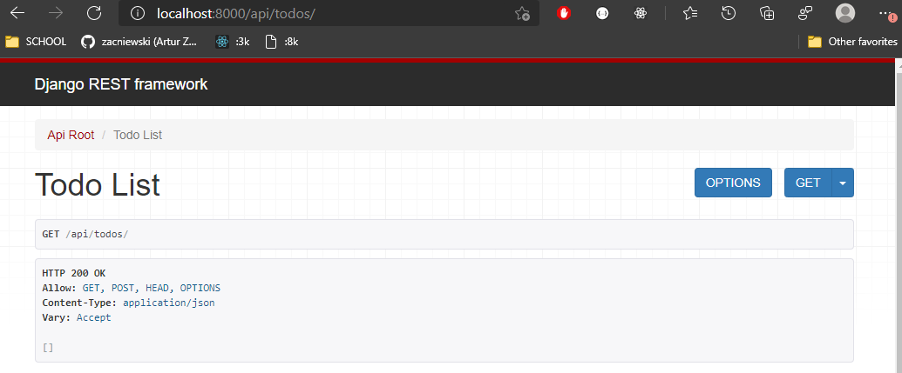 

### Widok stworzonej aplikacji - frontend
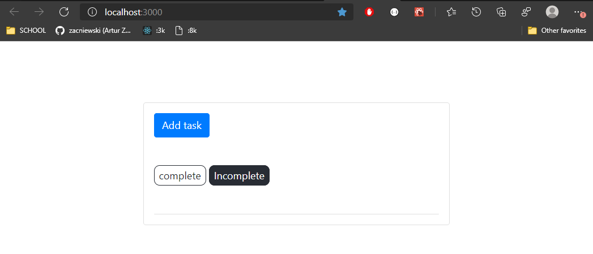 

### Dodawanie nowego zadania - wykonanego
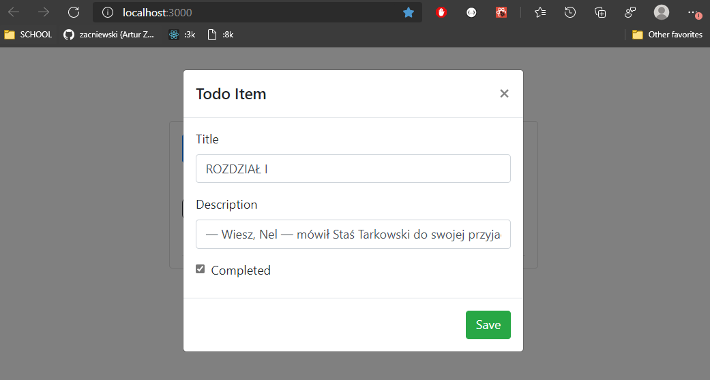 

### Widok dodanego zadania - wykonanego
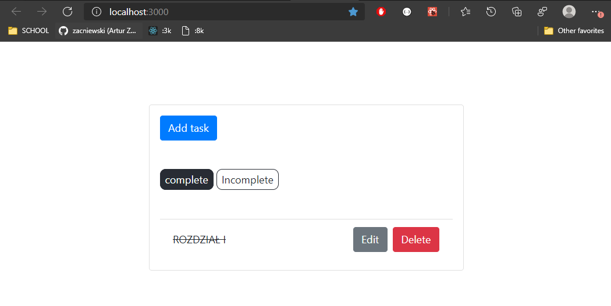 

### Dodawanie nowego zadania - oczekującego
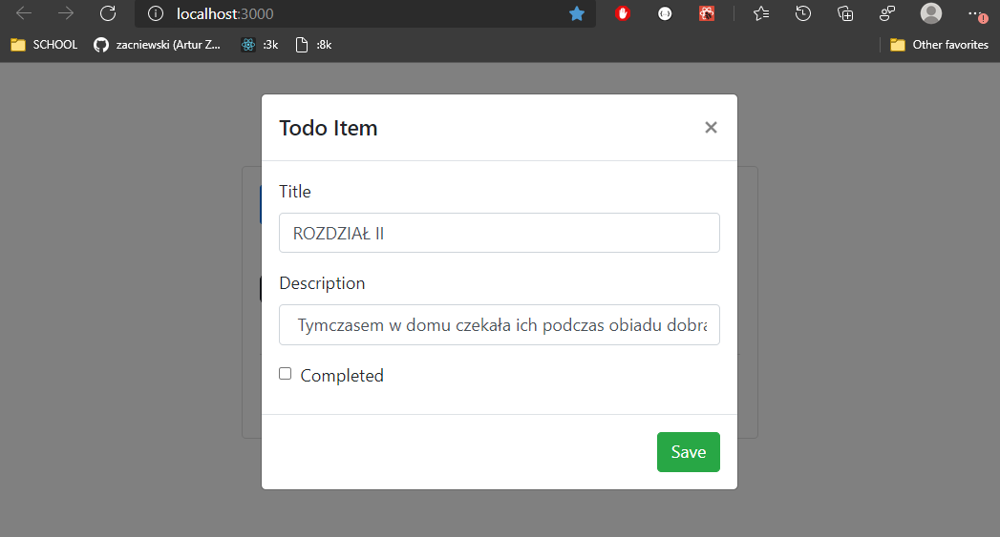 

### Widok dodanego zadania - oczekujacego
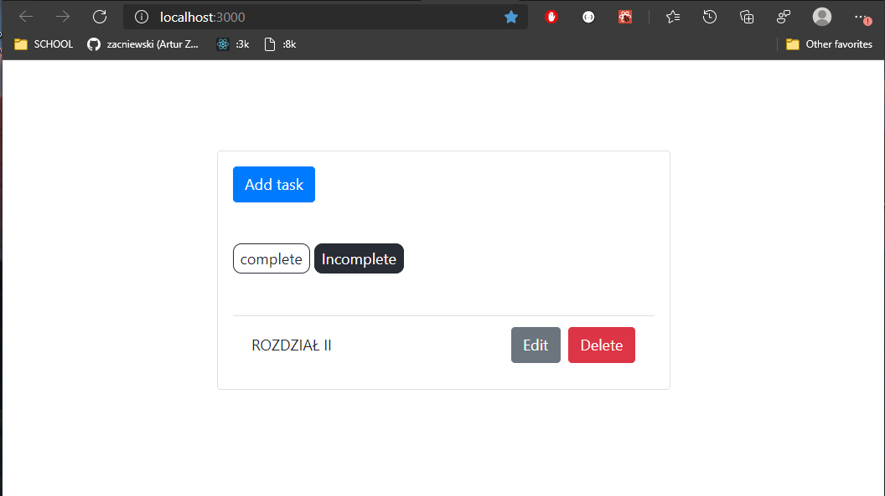 

### Dodałem jeszcze 1 wpis o tytule "ROZDZIAL III"
### Poniżej przedstawiam pełną listę zadań.
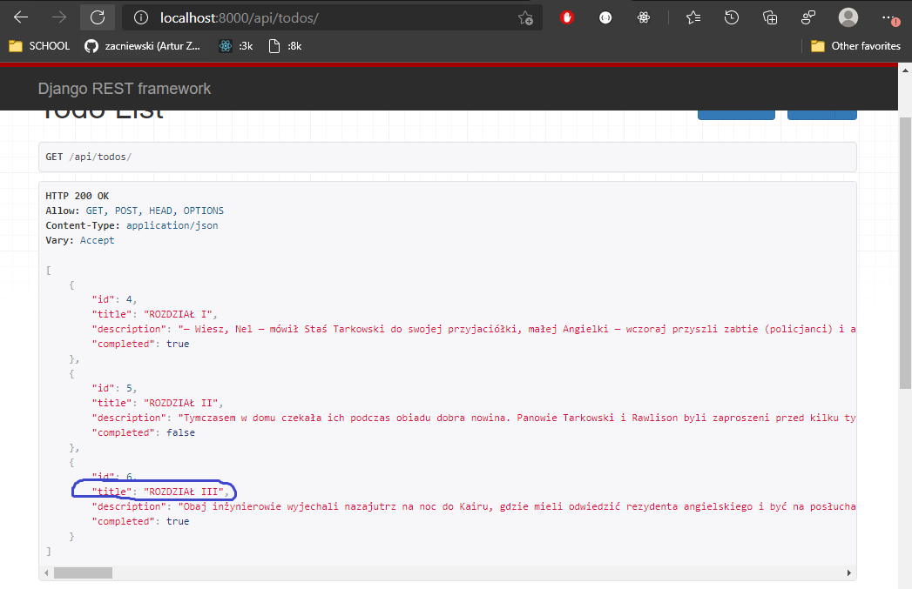 

### Edycja wpisu o tytule "ROZDZIAL III" na "Scena III"
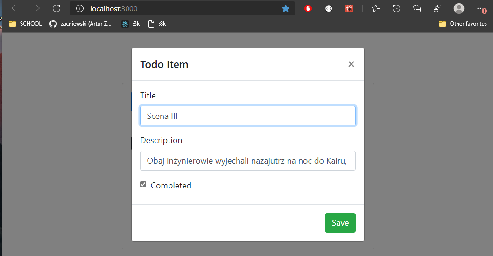 

### Zmiany jakie wprowadziła edycja.
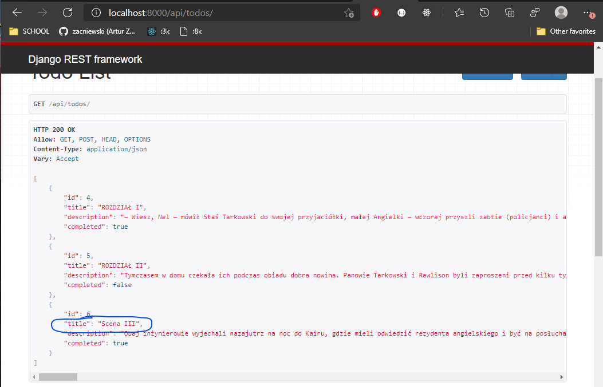 

### Usuwanie wpisu. - Sceny III
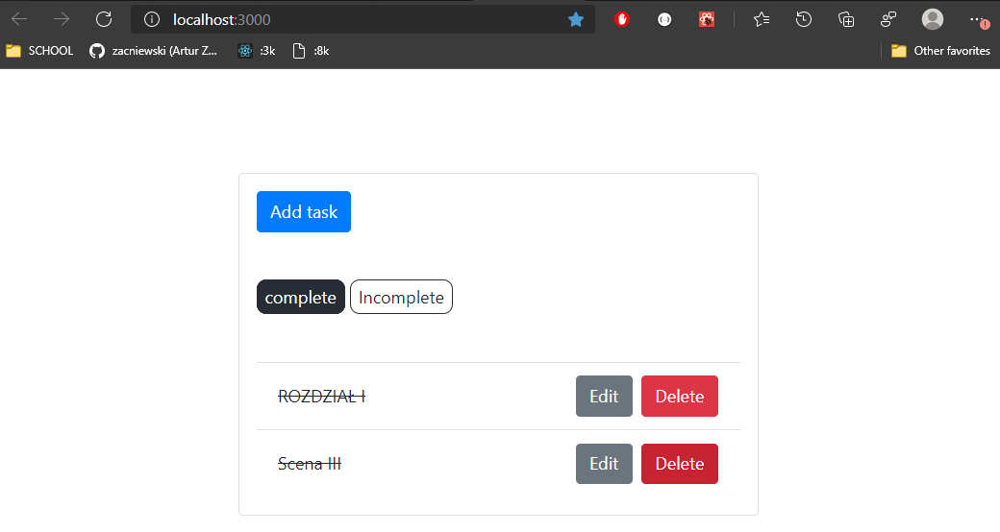 

### Widok zadań po usunięciu.
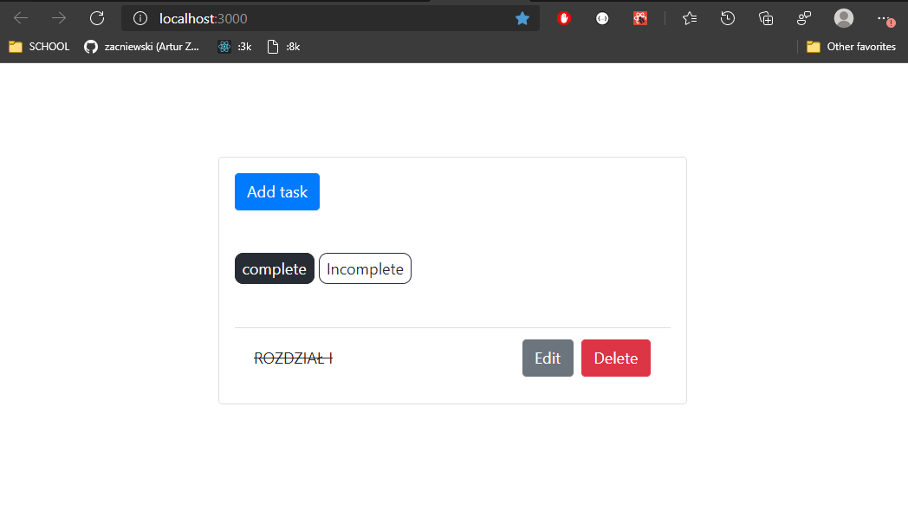 

### Ostateczny widok listy wpisów.
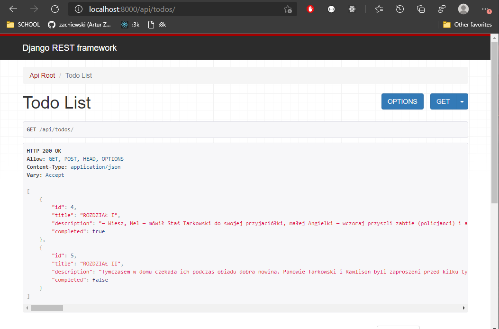 

